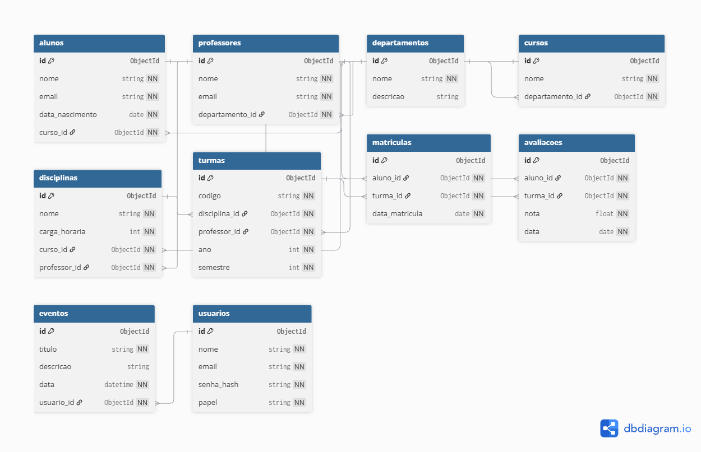

 Sistema de Gestão Educacional
 Tecnologias Utilizadas

Node.js

Express.js

MongoDB + Mongoose

Nodemon

Joi (validações)

Git & GitHub

VS Code

 Explicação e Descrição do Sistema

O Sistema de Gestão Educacional é uma API que centraliza informações acadêmicas de uma instituição de ensino.
O objetivo é organizar e facilitar o gerenciamento de alunos, professores, cursos, disciplinas, turmas, matrículas, avaliações, eventos e usuários administradores.

A API fornece endpoints REST que permitem criar, consultar, atualizar e remover dados de forma simples e escalável.

 Funcionalidades Implementadas
 Alunos

Cadastro, listagem, atualização e remoção.

Associação com cursos, turmas e matrículas.

 Professores

Cadastro e gerenciamento de professores.

Associação com disciplinas.

 Departamentos

Registro de departamentos acadêmicos.

 Cursos

CRUD completo.

Relacionamento direto com departamentos.

 Disciplinas

Cada disciplina pertence a um curso e pode ter professor associado.

 Turmas

Criação de turmas vinculadas a disciplinas e professores.

 Matrículas

Associação entre aluno, curso, turma e disciplina.

 Avaliações

Registros de notas, avaliações e desempenho do aluno.

 Eventos

Cadastro de eventos acadêmicos institucionais.

 Usuários

Gerenciamento de usuários do sistema (administração).

 Lista de Endpoints (com exemplos)
/alunos
GET /alunos
Resposta:
[
  {
    "id": "123",
    "nome": "João Silva",
    "curso": "Engenharia",
    "status": "ativo"
  }
]

/professores
POST /professores
{
  "nome": "Maria Rocha",
  "departamento": "Exatas"
}

/cursos
GET /cursos/123

/disciplinas
POST /disciplinas

/turmas
GET /turmas

/matriculas
POST /matriculas

/avaliacoes
POST /avaliacoes

/eventos
GET /eventos

/usuarios
POST /usuarios/login

(Inclua mais exemplos reais conforme forem implementando.)

 Diagrama de Modelagem

A imagem abaixo deve estar em:

/docs/diagrama-sistema.png

Insira aqui no README:

 Collections e Relacionamentos
alunos

nome, email, cursoId, turmaId

professores

nome, departamentoId

departamentos

nome, área

cursos

nome, cargaHoraria, departamentoId

Um curso tem várias disciplinas

disciplinas

nome, professorId, cursoId

Relaciona-se com turmas

turmas

disciplinaId, professorId, ano

matriculas

alunoId, disciplinaId, turmaId

avaliacoes

matriculaId, nota, data

eventos

titulo, descrição, data

usuarios

login, senha, cargo

 Instalação, Configuração e Execução
1️ Clonar o repositório
git clone https://github.com/math45rosa-crypto/trabalho002.git

2️ Instalar dependências
npm install

3️ Iniciar servidor
npm start

4️ Arquivo .env
MONGO_URI=mongodb://localhost:27017/escola
PORT=3000

🗄 Comunicação com o Banco de Dados

O sistema se conecta ao MongoDB utilizando Mongoose:

mongoose.connect(process.env.MONGO_URI)

Modelos representam collections.

Controllers executam operações CRUD.

Validators garantem consistência dos dados.

 Integrantes do Projeto
Nome	GitHub     Matricula
Wilson Ney Gomes Evangelista	github.com/Wilson604        24214290051
Gabrielle Rocha	github.com/Gabriella-alt                  24214290028
Matheus Henrique Rosa	github.com/math45osa-cripto         24214290029
 Contribuições dos Membros
Wilson Ney

Desenvolvimento das rotas principais (alunos, cursos, disciplinas, turmas).

Implementação de validações com Joi.

Documentação principal do README.

Organização da estrutura do projeto.

Gabrielle Rocha

Criação de models e relacionamentos.

Desenvolvimento do CRUD de matrículas e avaliações.

Testes iniciais dos endpoints.

Apoio no diagrama.

Matheus Henrique Rosa

Implementação de usuários, autenticação e eventos.

Revisão geral de rotas.

Configuração do banco de dados.

Criação e exportação do diagrama do sistema.

 Issues Resolvidas

Ajuste de validações incorretas.

Correção de nomes de collections.

Problemas de conexão com o MongoDB.

Erro em rotas duplicadas.

Padronização das respostas da API. 
